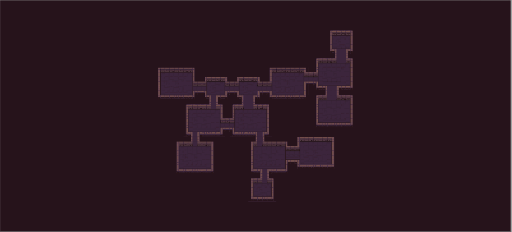
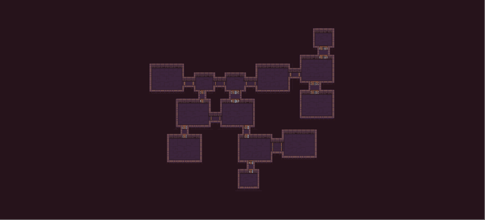

We talked about doors when we were designing room templates, but we did not add any actual door tiles. It would be probably more precise to use the term *connection* instead of *door* when talking about room templates. The goal of this tutorial is to describe two ways of adding actual door tiles to connections between individual rooms.

For this tutorial, we will use the tileset from [Example 1](example1.md). This tileset provides tiles to make doors with lengths of 1 or 2 tiles. Below you can seen an example of both possible lengths of doors.

<div class="two-columns">
<div>


*Before*

</div>

<div>


*After*

</div>
</div>

## Adding door tiles to room templates

In some simple situations, we can add door tiles directly to our room templates. However, we cannot add them to all room templates as we do not know beforehand which door positions will be used by the algorithm. But we can add them to our corridor room templates because there will be usually exactly two available door positions. You can see below how would that look like.

<div class="two-columns">
<div>


*Horizontal corridor*

</div>

<div>


*Vertical corridor*

</div>
</div>

This will work only if we have corridors enabled and we want to have door tiles placed on all used door positions.

## Adding door tiles via a pipeline task

First we have somehow to get all the door tiles that we need. We can either hardcode the paths to individual tile assets or we can do it through the editor. I think that the latter approach is better because we can reuse the task for a different tileset and we can also easily swap the tiles without changing the code. The task config looks like this:

```csharp
[CreateAssetMenu(menuName = "Dungeon generator/Examples/Example 1/Doors task", fileName = "DoorsTask")]
public class DoorsConfig : PipelineConfig
{
    public bool AddDoors;

    public TileBase HorizontalLeft;

    public TileBase HorizontalRight;

    public TileBase VerticalTop;

    public TileBase VerticalBottom;
}
```

You can see that I also added the *AddDoors* property to easily enable and disable the functionality. No we are going to write the actual logic. The basic structure looks like this:

```csharp
public class DoorsTask<TPayload> : ConfigurablePipelineTask<TPayload, DoorsConfig> 
    where TPayload : class
{
    public override void Process()
    {
        if (!Config.AddDoors)
        {
            return;
        }

        // Add door tiles
    }
}
```

And the result looks like this:

```csharp
public class DoorsTask<TPayload> : ConfigurablePipelineTask<TPayload, DoorsConfig> 
    where TPayload : class, IGeneratorPayload, IGraphBasedGeneratorPayload, INamedTilemapsPayload
{
    public override void Process()
    {
        if (!Config.AddDoors)
        {
            return;
        }

        // Iterate through all rooms
        foreach (var pair in Payload.LayoutData)
        {
            var roomInfo = pair.Value;

            // Check if corridor room
            if (roomInfo.IsCorridor)
            {
                // Iterate through all used door positons
                foreach (var doorInfo in roomInfo.Doors)
                {
                    // We cannot handle doors with length > 2
                    if (doorInfo.DoorLine.Length > 2)
                    {
                        continue;
                    }

                    if (doorInfo.IsHorizontal)
                    {
                        AddHorizontalDoors(doorInfo);
                    }
                    else
                    {
                        AddVerticalDoors(doorInfo);
                    }
                }
            }
        }
    }

    protected void AddHorizontalDoors(DoorInfo<Room> doorInfo)
    {
        Payload.CollideableTilemap.SetTile(doorInfo.DoorLine.GetNthPoint(0), Config.HorizontalLeft);

        if (doorInfo.DoorLine.Length > 1)
        {
            Payload.CollideableTilemap.SetTile(doorInfo.DoorLine.GetNthPoint(1), Config.HorizontalRight);
        }
    }

    protected void AddVerticalDoors(DoorInfo<Room> doorInfo)
    {
        Payload.CollideableTilemap.SetTile(doorInfo.DoorLine.GetNthPoint(0), Config.VerticalBottom);

        if (doorInfo.DoorLine.Length > 1)
        {
            Payload.CollideableTilemap.SetTile(doorInfo.DoorLine.GetNthPoint(1), Config.VerticalTop);
        }
    }
}
```

The code should be quite self-explaining.

> **Note:**: We add doors to the *Collideable* tilemap layer and we use the *INamedTilemapsPayload* to access the tilemap by its name rather than by its index.

This approach is very flexible as we can control where exactly we want to add doors. For example, we can add door tiles only to randomly chosen door position. The code would look like this:

```csharp
[CreateAssetMenu(menuName = "Dungeon generator/Examples/Example 1/Doors task", fileName = "DoorsTask")]
public class DoorsConfig : PipelineConfig
{
    // Basic properties here

    [Range(0f, 1f)]
    public float Probability = 1;
}

public class DoorsTask<TPayload> : ConfigurablePipelineTask<TPayload, DoorsConfig> 
    where TPayload : class, IGeneratorPayload, IGraphBasedGeneratorPayload, INamedTilemapsPayload, IRandomGeneratorPayload
{
    public override void Process()
    {
        if (!Config.AddDoors)
        {
            return;
        }

        // Iterate through all rooms
        foreach (var pair in Payload.LayoutData)
        {
            var roomInfo = pair.Value;

            // Check if corridor room
            if (roomInfo.IsCorridor)
            {
                if (Payload.Random.NextDouble() < Config.Probability)
                {
                    // Add doors
                }
            }
        }
    }
}
```