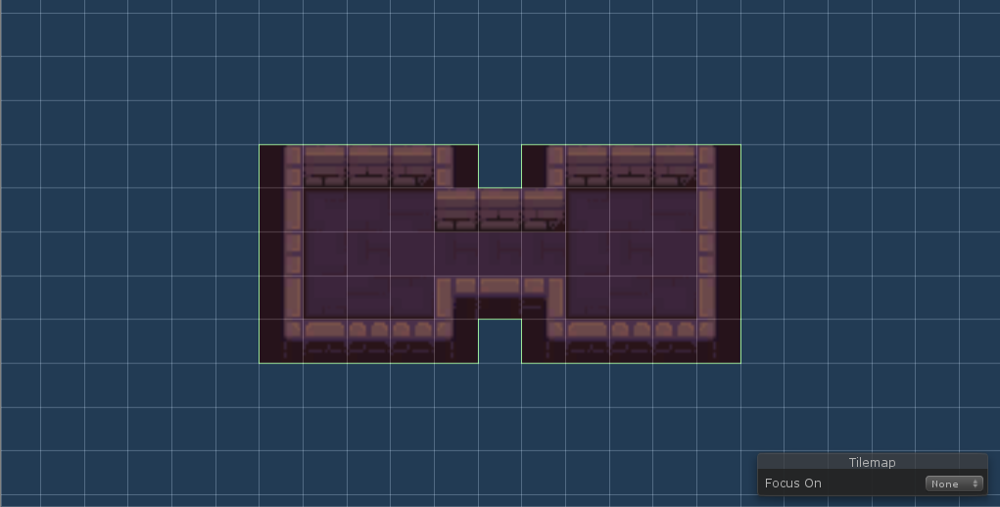
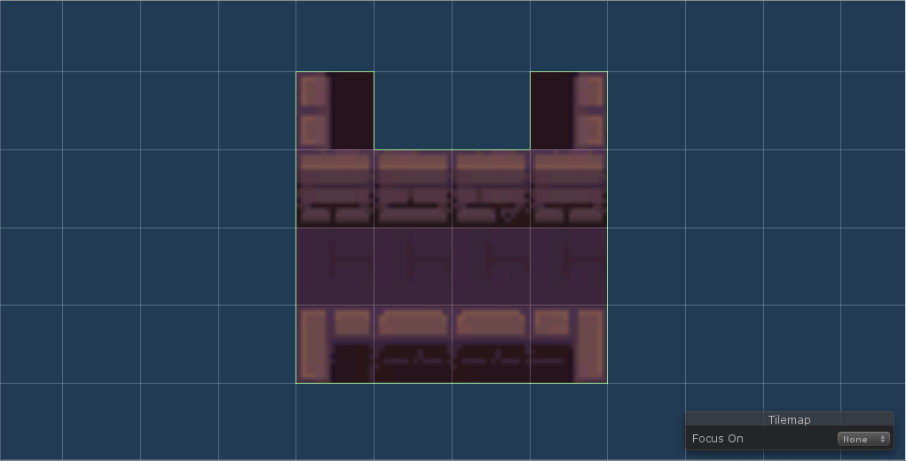
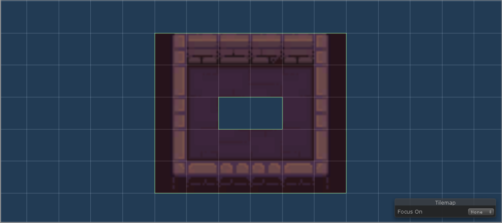

Room templates are one of the main concepts of the algorithm. They describe how individual rooms in the dungeon look and how they can be connected to one another. 

## Terminology
- Room layout - how a room looks, tiles with sprites, walls, floors, furniture, etc.
- Room shape - floor plan of a room layout
- Door - all possible positions of doors of a room layout
- Room template - room layout together with doors

## Room layout

We will use Unity [Tilemaps](https://docs.unity3d.com/Manual/class-Tilemap.html) to design our room layouts so you should be familiar with that. The whole room template consists of a *Grid* *GameObject* that has one or more child *Tilemap* *GameObjects* and a *Doors* script attached. You can use all available tools (brushes, rule tiles, etc.) to paint tilemaps. 

*Example room layout*

### Tilemaps

The plugin is also prepared to handle layouts consisting of multiple tilemaps if you want to have multiple layers of tiles. In fact, the default configuration of the plugin uses several tilemaps because you cannot really do that much with a single layer of tiles. The default structure of tilemaps is as follows:

- **Walls** - order 0, with collider
- **Floor** - order 1 
- **Collideable** - order 2, with collider
- **Other** 1 - order 3
- **Other 2** - order 4
- **Other 3** - order 5

It is **VERY IMPORTANT** that all room layouts are structured exactly like this because tiles from tile layouts will be copied to correspoding tilemaps of generated dungeon layouts. The names of individual tilemaps are not really important - I just thought that it may be better than simply numbering them and the algorithm currently does not care whether there are walls in the first tilemap or not.

To make it easier to create room templates, there is a *DefaultRoomTeplateInitializer* script that can be added to an empty *GameObject* and then used to create the correct structure of tilemaps. See the video below.

*Initializing tilemaps using the DefaultRoomTeplateInitializer script*

If you need a different structure of tilemaps, you can override the default behaviour. See [Tilemap layers](generatorPipeline_tilemapLayers.md).

> **Feedback needed:** The default structure of tilemaps aims to provide a reasonable structure for game designers to start creating room layouts. However, I have got no experience with working with tilemaps in real projects so I would like to hear any feedback on whether this structure is a good default or not.

### Room shape

The underlying algorithm works with polygons, not tilemaps, tiles and sprites. We call these polygons room shapes and they are simply outlines/floor plans of corresponding room layouts. However, not all room shapes are valid in the context of the algorithm. The goal of this section is to describe how can room shapes look like.

*The green outline shows the room shape of a corresponding room layout*

> **Note:** Because we are only interested in the outline of a room layout, the internal structure (number, order) of tilemaps is irrelevant. For the purpose of the computation we can imagine that all tiles are in a single tilemap.

#### One connected component

I will not go into formal definitions. The image below should be self-explanatory.

*Wrong*

*Correct*

#### Each tile atleast two neighbours

Each tile must be connected to at least two neigbouring tiles. In the image below, both tiles in the upper row are connected to only a single neighbour so the room shape is not valid. If we need these two tiles, we can simly fill the upper row with *empty* or transparent tiles.

*Wrong*

*Correct*

#### Without holes

There must be no holes in room layouts (a null tile surrounded by non-null tiles). Again, we can fill such holes with *empty* or transparent tiles if we need them there.

*Wrong*

*Correct*

> **NOTE:** This is only a limitation of the current algorithm for computing room shapes from room layouts and the constraint will be probably dropped in the future.

## Doors

## How to create a room template