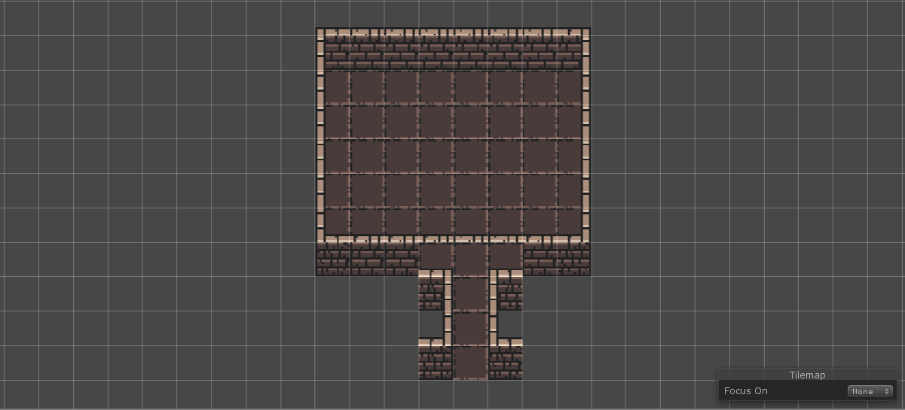

With some tilesets, it is not possible to correctly connect corridors to rooms without the need of some postprocess. The goal of this tutorial is to demonstrate how to use pipeline tasks to correct such problems. I will use the tileset from [Example 1](example1.md) to describe the problem and show how to fix it.

## Problem

The problem with this tileset is that there is an additonal row of lighter tiles above all wall tiles. This is problematic because we must put all door positions on the outline of a room layout and that means that we cannot correctly connect corridor rooms. This can be seen in the images below.

*Basic room template*

*Incorrent vertical corridor*

*Incorrect connection*

*Incorrect connection*

> **Note:** This problem could be also fixed by making it possible to have door position outside the outline, but that is currently not supported by the dungeon generator library. 

## Solution

The solution is remove the top and bottom rows from the vertical corridor room template (see below) and then write a script that fixes the connection.

*Correct vertical corridor*

*Before correction*

There are probably multiple ways of doing that. I chose to draw a so-called correction room layout (below) and then use these tiles to correct corridors connections. The advantage of this approach is that in the script we do not have to deal with which tile should be placed in which tilemap layer. We simply draw the correction layout using the same tilemap layers are for all other room templates and then copy all tiles to their corresponding tilemaps.

*Correction layout*

> **Note:** Only the topmost and bottommost rows of tiles are used from the correction layout. The middle rows are present only to make it easier to draw the correction layout.

> **Note:** We can use the correction layout to correct corridors with different widths by simply repeating the middle tile.

TODO script