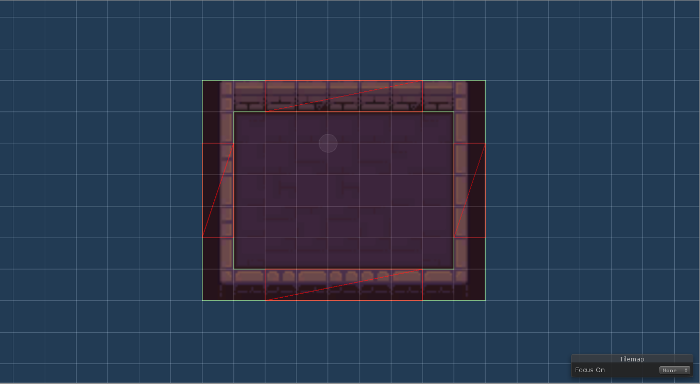
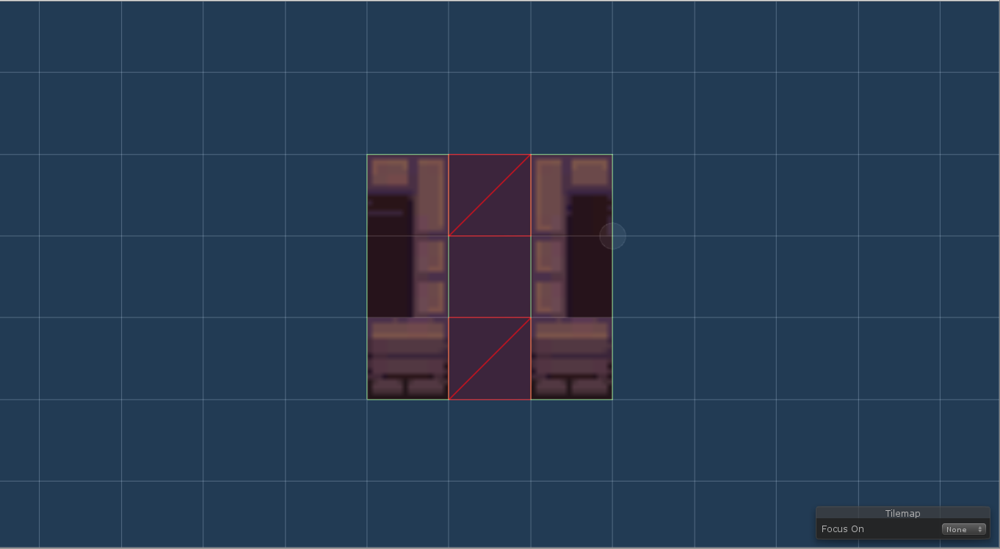
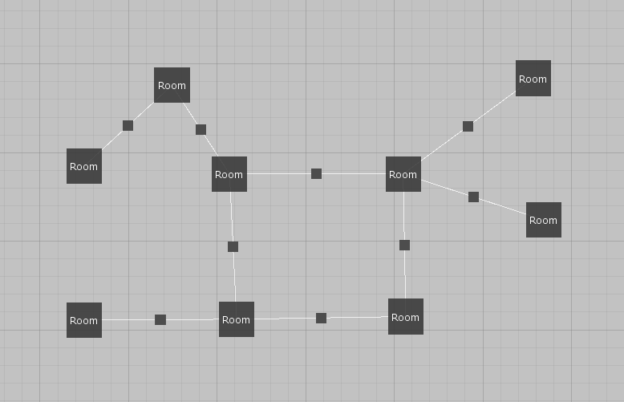
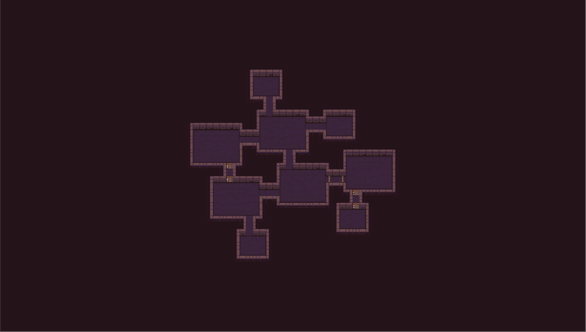
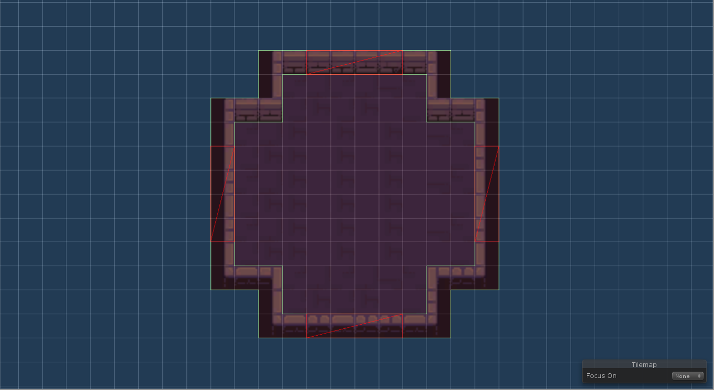
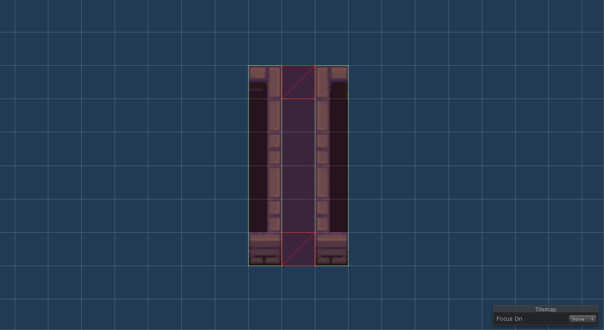

In this tutorial, we will use [this tileset](https://pixel-poem.itch.io/dungeon-assetpuck) from by [@pixel_poem](https://twitter.com/pixel_poem). Be sure to check his work out if you like the tileset. We will not care about room decorations - we will use just basic walls, floor and  door tiles. 

*Simple example*

*Real-life example*

## Simple example

The goal is to create two basic rectangular room remplates of different sizes and a room template for both horizontal and vertical corridors. We will use the smaller room template for our dead-end rooms and the bigger room template for other rooms.

### Basic rooms romplates

There should be nothing hard about the design of the two rectangular room templates. We use the *simple doors mode configured* to door length 1 and corner distance 2. We need corner distance 2 in order to easily connect corridors.

*Bigger room*

*Smaller room*

### Corridors

Corridors are very simple with this tileset. We use the *specific positions* doors mode to choose the two possible door positions. And because corridors are by default placed after non-corridor rooms, these room templates just work without the need of any scripting.

*Horizontal corridor*

*Vertical corridor*

We just need to make sure that we do not allow door positions of non-corridor rooms that are closer than 2 tiles from corners. Below you can see what would happen otherwise. It is possible to allow that but we would have to create a pipeline task that would fix such cases.

*Incorrect corridor connection*

### Level graph

With only two room templates for non-corridor rooms, we must think about which level graphs are possible to lay out and which are not. For example, using only the bigger room template, the algorithm is not able to lay out cycles of lengths 3 and 5 because there simply is not any way to form these cycles with such room templates. But cycles of length 4 are possible do that is what we do here.

*Level graph*

### Results

*Example result*

*Example result*

## Real-life example

To create something that is closer to a real-life example, we will add more rooms to the level graph, add special room templates for spawn and boss rooms and also two more corridor room templates.

### Spawn and boss rooms

*Spawn room template*

*Boos room template*

### Additional room template

Even for ordinary rooms, we can have non-rectangular room templates.

*Additional room tempalte*

### Longer corridors

*Longer horizontal corridor*

*Longer vertical corridor*

### Level graph

TODO

*Level graph*

### Results

*Example result*

*Example result*

