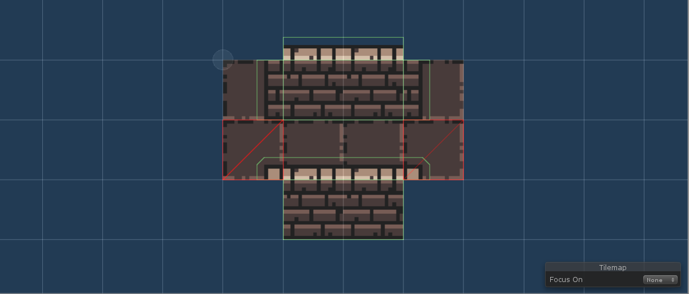
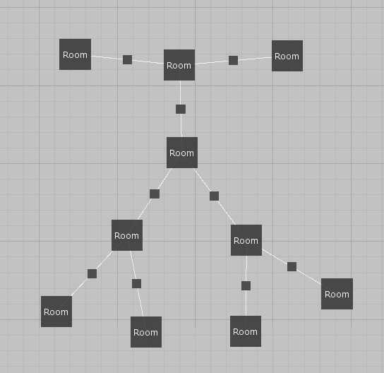
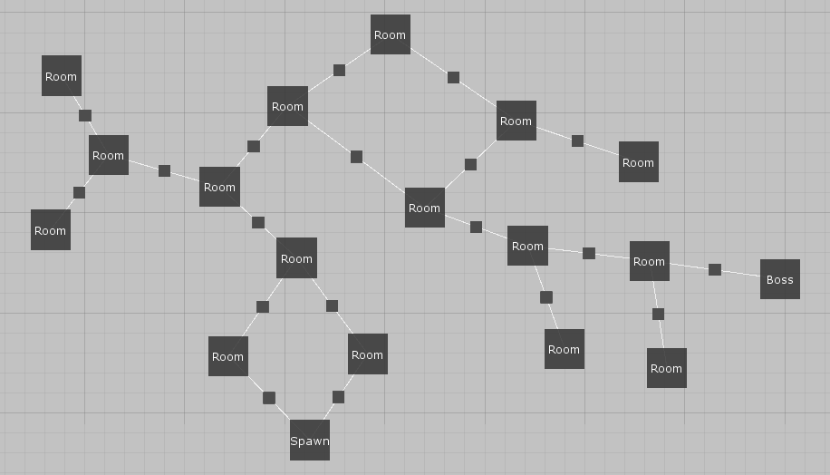
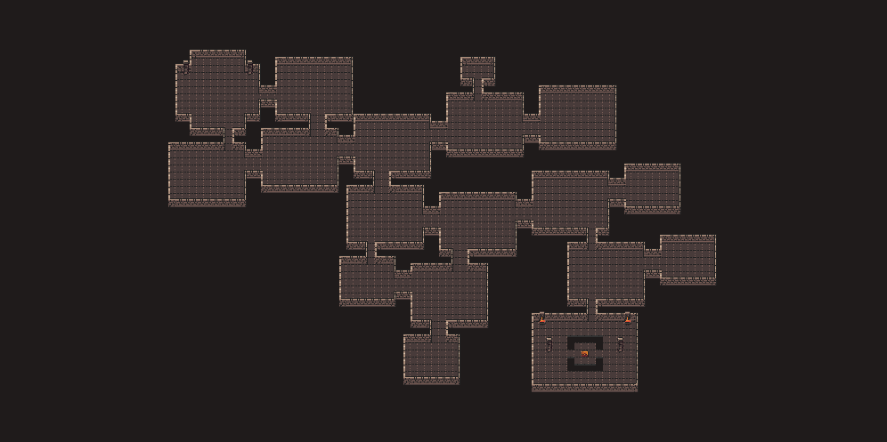

In this tutorial, we will use [this tileset](https://0x72.itch.io/dungeontileset-ii) by [0x72](https://0x72.itch.io/). Be sure to check their work out if you like the tileset. We will not care about room decorations - we will use just basic walls, floor and  door tiles.

*Simple example*

*Real-life example*

> **Note:** I recommend reading [Example 1](example1.md) first as this is a little bit harder to setup and I will not repeat the basics here.

> **Note:** All files from this example can be found at *ProceduralLevelGenerator/Examples/Example2*.

## Simple example

The goal is to create two basic rectangular room remplates of different sizes and a room template for both horizontal and vertical corridors.

> **Note:** This tileset is trickier than the one used in [Example 1](example1.md) because there is an additional row of ligther tiles above all horizontal wall tiles. It will cause us problems when working with corridors.

### Basic rooms romplates

For this example, I am using doors with two different lengths (1 and 2). That means that we have to use the *Specific positions mode* mode because the *Simple mode* can only handle doors with the same length. As you can see below, the door positions look quite messy because they overlap.

*Smaller room*

*Bigger room*

### Corridors

As I said before, there is a problem with corridors when working with this tileset. To be more precise, there is a problem with vertical corridors because of the additional roow of tiles above wall tiles. If we were to design our vertical corridors as in Example 1, we would end up with something like this:

*Incorrent vertical corridor*

*Incorrent connection*

Unfortunately, we cannot solve this problem just by designing our room templates in a different way. Therefore, we will have to solve this by a pipeline task - the procedure is described in the [Corridors correction](corridorsCorrection.md) tutorial. For this tutorial it is sufficient to know that we have to design our vertical corridors without the top and the bottom rows.

*Horizontal corridor*

*Vertical corridor*

### Level graph

*Level graph*

### Results

*Example result*

*Example result*

## Real-life example

To create something that is closer to a real-life example, we will add more rooms to the level graph, add special room templates for spawn and boss rooms and also two more corridor room templates.

### Spawn and boss rooms

*Spawn room template*

*Boos room template*

### Additional room template

We can make generated dungeons more interesting by adding smaller room templates to our dead-end rooms.

*Additional room tempalte*

### Wider corridors

*Wider horizontal corridor*

*Wider vertical corridor*

### Level graph

So the goal is to have more rooms than in the simple example and also a spawn room and a boss room. You can see one such level graph below.

*Level graph*

### Results

*Example result*

*Example result*
