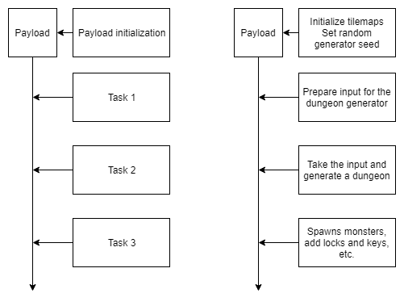

From the beginning, I wanted the plugin to be as extensible as possible, but also usable for people who are not programmers. The main goals were:

- For users to be able to configure the generator in Editor.
- For users to be able to easily replace individual parts of the algorithm without having to change the plugin's code.
- For me to be able to provide basic functionality that can be combined with functionality added by users.

After some research, I decided to implement the plugin as a pipeline consisting of tasks that operate on a payload that goes through all the tasks. Below you can see an example of a pipeline - both an abstract example and a real-life example.

*Pipeline example*

Internally, the generator is simply an array of pipeline tasks together with a script that can initialize the payload. And because all these scripts inherit from ScriptableObject, we can easily work with them in the inspector window.

*Example pipeline as seen in the inspector window.*