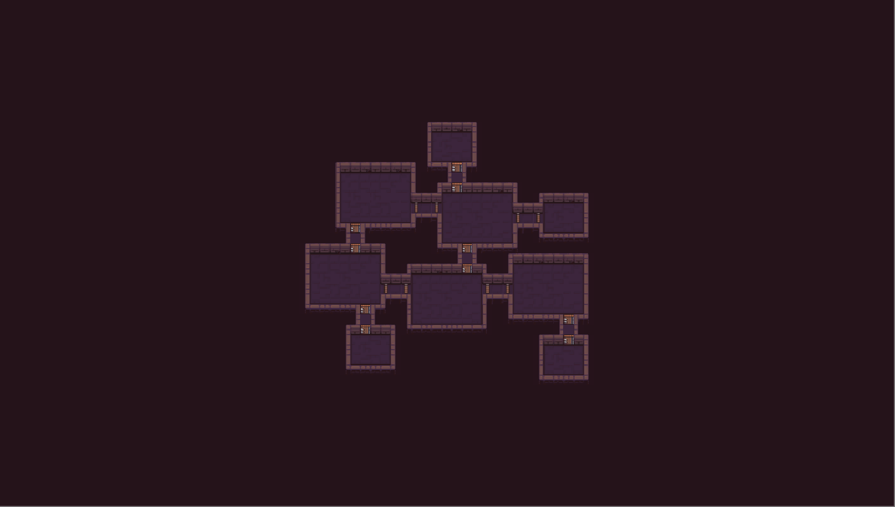
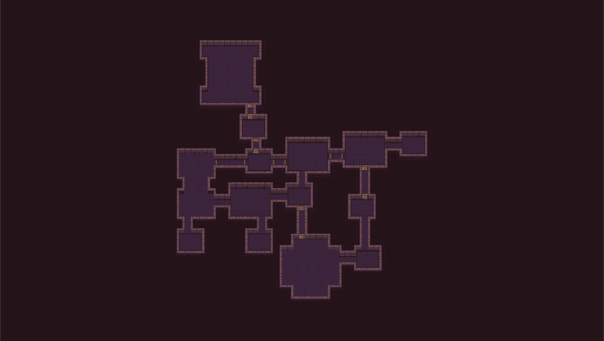
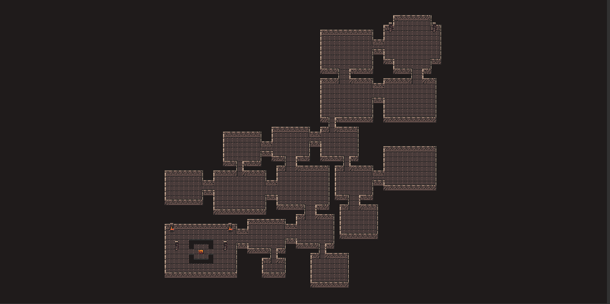

This project is a Unity plugin for procedural generation of 2D dungeons and aims to give game designers a complete control over generated layouts. Under the hood, the plugin uses my [procedural level generator](https://github.com/OndrejNepozitek/ProceduralLevelGenerator).

The plugin is currently in its early alpha stage of development and I am mostly **looking for feedback**. The main focus of my Master thesis is to further improve my dungeon generator library so any feedback is really appreciated and will most likely lead to making the library (and therefore also this plugin) closer to being usable in production scenarios. Please read the Shortcomings section before trying out the plugin.

## Features

**Complete control over the look of individual rooms.**
You can draw room templates using Unity built-in Tilemap feature. You can use all available tools (brushes, rule tiles, etc.) to design room templates.

**Complete control over the structure of generated layouts.** Instead of generating completely random dungeons, you specify how many rooms you want and how they should be connected and the generator finds dungeons that follow exactly that structure.

**Rooms either directly connected by doors or connected by corridors.** You can choose to either connect all rooms by corridors or to not use corridors at all. But I plan to make it possible to configure that on a per-connection basis in the future.

**Easy to customize.** The plugin is ready to be customized and extended. All important parts of the plugin can be replaced with a different implementation.

## Shortcomings

**Alpha version.** There are probably bugs tham I am not aware of (and also bugs that I am aware of but not yet fixed). Moreover, there will be **breaking changes** in the API.

**Not everything can be configured via editor.** You  need to have programming knowledge in order to generate anything non-trivial. The plugin currently does not help you to handle monster spawns, triggers, etc. It handles only positions and shapes of rooms and basic templating.

**Performance hiccups.** The underlying algorithm searches through a space of possible layouts until it finds a layout that satisfies all contraints given by the level graph. And because the algorithm is stochastic, the number of iterations needed to find a layout may greatly vary. And if the algorithm is very unlucky, it may struggle even on simpler inputs. This will be addressed in the future.

**.NET CLR vs Mono CLR performance.** After performing a really simply benchmark of the dungeon generator algorithm using .NET CLR and Mono CLR, it seems like on Mono CLR the algorithm is up to 3 times slower. Unfortunately, Mono is the runtime of choice in Unity so I cannot really do much with that. If Unity ever switches to CoreCLR, we may see a significant performace gain.

## Planned features

**Improved corridors.** Currently, we have to manually specify all corridor room templates. That means specifying a room template for each possible length of corridors. But we usually do not care that much about the length - it would be more convenient to simply say that we want to have corridors of lenghts 3 to 10 than having to do that manually. Moreover, the algorithm currently works well only with straight corridors and cannot really handle i.e. l-shaped corridors.

**Support for caves and other organic shapes.** If we want to introduce caves to our generated dungeons, we have 2 options. The first option is to create a room template for the cave. The problem is that all our caves will look exactly the same even though there is a big potential to make caves procedural, making generated dungeons less repetetive. The second option is to make a simple rectangular room template and apply postprocessing afterwards to make it look like a cave. This approach solves the problem with all caves being identical. However, the problem with this approach is that the algorithm internally works with the rectangular shape and is therefore limited. It would be better to tell the algorithm that we do not really care if the shape is exactly rectangular, which would give the algorithm more freedom and it would converge faster.

## Terms of use

The plugin can be used in bot commercial and non-commerical projects but **cannot be redistributed or reselled**. If you want to include this plugin in your own asset, please contact me and we will figure that out.

## Examples

*Example 1*

*Example 1*

*Example 2*

*Example 2*

