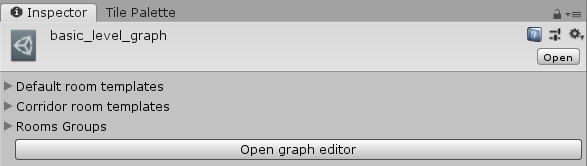
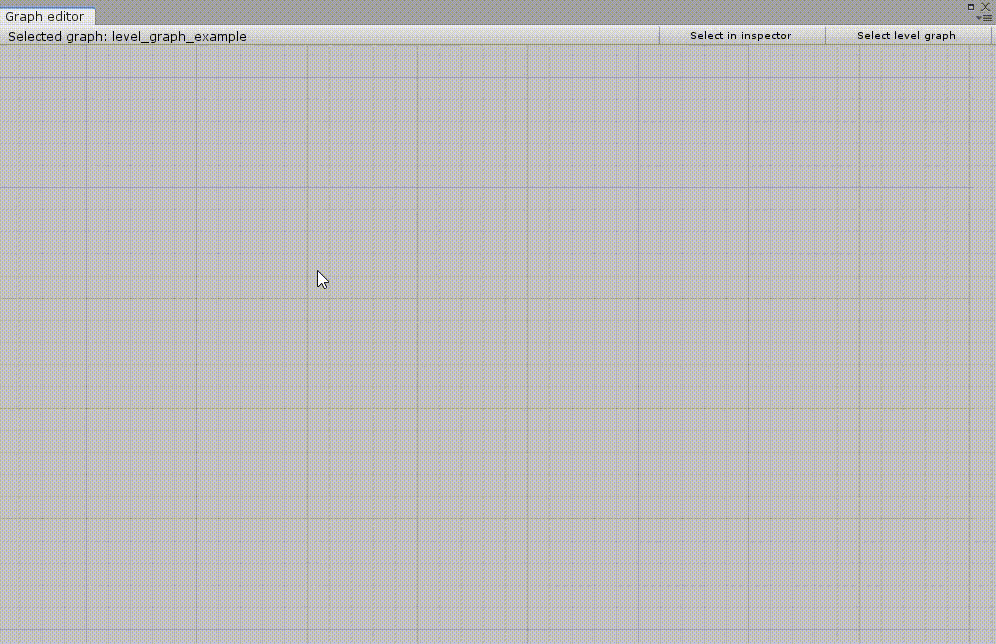
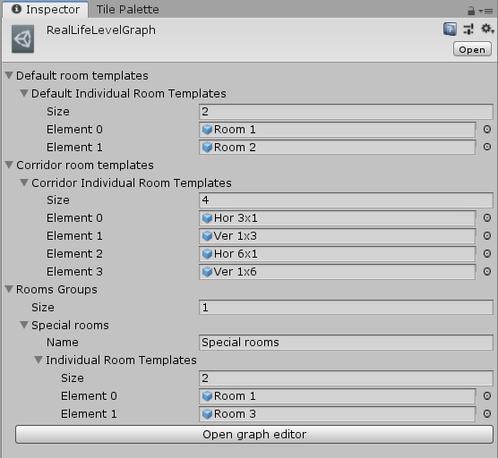

Layout graph is an abstraction that lets us control the structure of generated layouts. 

> **Note:** In the context of this plugin, the term *graph* is used to refer to a mathematical structure consisting of nodes and edges, not a way to visualise functions.

## Basics

Layout graph consists of rooms and room connections. Each room corresponds to a room in a generated layout and each connection tells the algorithm that the two rooms must be connected either directly to each other or via a corridor.

Below you can see a simple level graph with 5 rooms and 4 connections. If we use this level graph as an input for the algorithm, each generated dungeon will have exactly 5 rooms and *room 1* will be connected to every other room in the dungeon.

*Simple level graph with 5 rooms and 4 room connections.*

> **Note:** It is not important how we draw the graph. It is only important how many rooms there are and which rooms are connected to each other.

## Limitations

### Planar graphs

Level graphs must be **planar**. We say that a graph is planar if it can be drawn on the plane in such a way that no two edges intersect. In our case that means that no two connection lines may intersect. If the input graph was not planar, we would not be able to find a dungeon without rooms or corridors overlapping one another.

> **Note:** A level graph may be planar even if we draw it in a way that some edges intersect. It is because even if one drawing of the graph is "incorrect", that does not mean that there are intersecting edges in all drawings.

### Connected graphs

Level graphs must be **connected**. We say that a graph is connected if there is a path between every pair of vertices. Below you can see a level graph that is not connected because there is no path between vertices on the left side and vertices on the right side.

*Example of a level graph that is not connected.*

## Creating level graphs

*LevelGraph* is a ScrptableObject that can be created by navigating to *Create -> Dungeon generator -> Level graph*. Below you can see how are level graphs display in the Inspector window.

*Level graph in the Inspector window.*

### Graph editor

The Graph editor window can be opened by clicking the *Open graph editor* button.

*Graph editor window.*

Window controls:
- *Selected graph*: name of the currently selected level graph
- *Select in inspector*: selects the current graph in the inspector window
- *Select level graph*: selects a different level graph

Working with level graphs:
- *Create room*: right click on an empty space in the grid and select *Add room*
- *Delete room*: right click on a room and select *Delete room*
- *Move room*: left click and then drag around
- *Add connection*: hold *ctrl* while left-clicking a room and then moving the cursor to a different room
- *Delete connection*: right click on a connection handle and select *Delete connection*

*Level graph controls.*

### Room templates

When we have our rooms and connections, it is time to setup room templates. In the *Level graph* inspector window above, we could see 3 sections - *Default room templates*, *Corridor room templates* and *Rooms groups*. These section are used to specify which room templates are available for which room. Below you can see the setup from [Example 1](example1.md).

*Example of assigned room templates.*

> **Note:** The word "individual" is included when working with room templates because there are plans to group room templates into sets and use them instead of working with individual room templates. However, that feature is not yet ready.

#### Default room templates

Array of room templates that will be used for rooms that have no room shapes assigned. We can use this for our basic rooms and then configure our special rooms (spawn room, boss room, etc.) to use a different set of room templates.

#### Corridor room templates

Array of room templates that will be used for corridor rooms. These room templates will be used if we setup the algorithm to use corridors instead of connecting rooms directly by doors. Can be left empty if we do not want to use corridors.

#### Rooms groups

We can use this section to create groups of rooms which can be then assigned to individual rooms and that room then inherits all room templates from the group (replacing all room templates that were assigned to that room).

#### Configuring individual rooms

If we right click on a room in the Graph editor, we can select *Configure room* to open a window with room configuration. We can set the name of the room which will be displayed in the Graph editor. We can also assign room templates that will be used only for this room. If we assign any room template, the room will ignore all default room templates. If we add a room to a rooms group, it will use only room templates from that group.

*Configuration of a spawn room.*

*Configuration of a room that is assigned to a rooms group.*